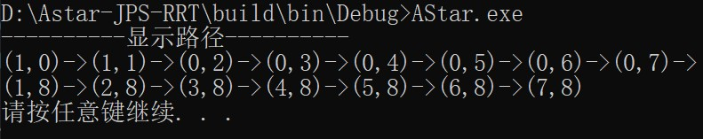
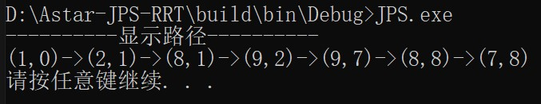
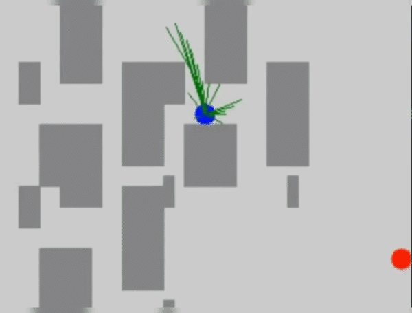

# <p align="center">Astar-JPS-RRT</p>
<p align="center">
  <a href="./README.md">🌏 English</a> | 🇨🇳 中文
</p>

**这是一个轻量化的路径规划算法仓库，目前支持的算法有：基于图搜索的Astar和JPS，以及基于采样的RRT，RRT_Star和Informed_RRT_Star**

## 🔥 特性
1. 轻量化：依赖少，代码实现简洁
2. 可视化：基于OpenCV库，实现路径规划算法的效果可视化
3. 跨平台：该项目支持Windows和Linux系统
4. 复用性：该项目的代码稍加修改后，可以用做基于ROS的路径规划算法研究

## 📦 安装
### Windows
先去官网安装OpenCV库：https://opencv.org/releases/ ，选择Windows下的稳定版本**OpenCV-4.9.0**。安装完成后，需要配置环境变量。接下来的步骤：
```bash
git clone https://github.com/X-Noname-X/Astar-JPS-RRT.git
# 修改Sample_Algorithms\RRT_Series\CMakeLists.txt中的opencv解压路径，确保路径下能找到OpenCVConfig.cmake文件
set(OpenCV_DIR "<填写你的opencv解压路径>")
# 在Astar-JPS-RRT目录下创建build目录并进入
mkdir build
cd build
# 构建编译文件
cmake ..
# 编译
cmake --build .
```

### Ubuntu
1.安装OpenCV依赖，通过 Ubuntu 官方源 /apt 安装：无需手动配置路径，编译时系统自动识别：
```bash
# 更新源
sudo apt update
# 安装 OpenCV 开发包（包含头文件和库）
sudo apt install -y libopencv-dev
```
2.该项目的安装与编译：
```bash
git clone https://github.com/X-Noname-X/Astar-JPS-RRT.git
# 注释CMakeLists.txt中的set(OpenCV_DIR "<填写你的opencv解压路径>")
set(OpenCV_DIR "<填写你的opencv解压路径>") ## 注释
# 下面步骤和Windows系统一致
mkdir build
cd build
cmake ..
# 编译
cmake --build .
# 编译也可以使用
# make
```

## 🛠️ 运行
### Windows
- 如果一切顺利的话，会在 \Astar-JPS-RRT\build\bin\Debug 路径下看到：Astar.exe, JPS.exe, RRT_Series.exe
- **直接点击.exe文件，或者在终端输入Astar.exe即可运行**
```bash
# 运行Astar
\path\to\Astar-JPS-RRT\build\bin\Debug>Astar.exe
# 运行JPS
\path\to\Astar-JPS-RRT\build\bin\Debug>JPS.exe
# 运行RRT
\path\to\Astar-JPS-RRT\build\bin\Debug>RRT_Series.exe
```
- **注意：** 通过修改 \Astar-JPS-RRT\Sample_Algorithms\RRT_Series\src 的main.cpp文件中的宏定义（#define），实现RRT，RRT_star和Informed_RRT_star的切换

### Ubuntu
完成安装与编译后，/Astar-JPS-RRT/build/bin 路径下有：Astar, JPS, RRT_Series三个可执行文件，终端运行：
```bash
cd /path/to/Astar-JPS-RRT/build/bin
./Astar
./JPS
./RRT_Series
```

## 🎮 效果
Astar和JPS算法暂时没有可视化
| Astar |  |
|:---:|:---:|

| JPS |  |
|:---:|:---:|

| RRT | RRT* | Informed RRT* |
|:---:|:---:|:---:|
|  |  |  |